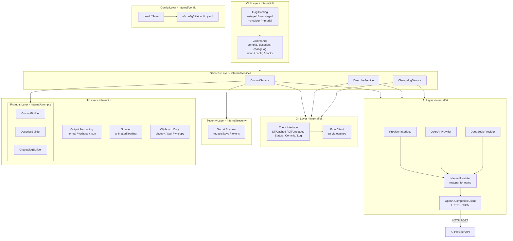

# GitX — AI Powered Git Assistant

GitX is an AI-powered command-line Git assistant that improves developer productivity by generating commit messages, pull request descriptions, and changelogs.

**Git remains the source of truth.** GitX provides intelligence and automation around existing Git workflows — it never commits without approval, never pushes code, and never modifies source code without user permission.

## Features

- **`gitx commit`** — Generate commit messages from staged or unstaged changes with interactive confirmation
- **`gitx describe`** — Describe the current repository state (commits, staged, and/or unstaged changes)
- **`gitx changelog`** — Generate changelog entries from git tags and commits
- **`gitx setup`** — Interactive configuration: pick provider, model, and API key
- **`gitx config`** — Manage configuration (provider, model, API key, commit style)
- **`gitx doctor`** — Diagnose installation and configuration issues

## Installation

### Quick install (macOS / Linux)

```bash
# Recommended (requires sudo for /usr/local/bin)
curl -fsSL https://raw.githubusercontent.com/deveasyclick/gitx/main/scripts/install.sh | sudo sh

# User-local install (no sudo needed)
curl -fsSL https://raw.githubusercontent.com/deveasyclick/gitx/main/scripts/install.sh | GITX_INSTALL_DIR=~/.local/bin sh
```

### From source

```bash
git clone https://github.com/deveasyclick/gitx
cd gitx
make build
```

The binary is placed at `bin/gitx`. Add it to your PATH:

```bash
export PATH="$PATH:$(pwd)/bin"
```

### With Go installed

```bash
go install github.com/deveasyclick/gitx/cmd/gitx@latest
```

### Platform support

- Linux (amd64, arm64)
- macOS (amd64, arm64)
- Windows (amd64, arm64)

## Uninstall

### macOS / Linux

```bash
# 1. Remove the binary (check which directory it was installed to)
rm -f /usr/local/bin/gitx   # if installed with sudo
rm -f ~/.local/bin/gitx     # if installed without sudo

# 2. Remove the config file and API keys
rm -rf ~/.config/gitx

# 3. Remove git aliases (if installed)
sh scripts/git-aliases.sh --uninstall

# Or remove them manually:
# git config --global --unset alias.gbc
# git config --global --unset alias.gbd
# ...
```

### Windows (PowerShell)

```powershell
# 1. Find and remove the binary
where.exe gitx
Remove-Item C:\Users\<user>\bin\gitx.exe  # adjust path

# 2. Remove the config file
Remove-Item -Recurse -Force $env:USERPROFILE\.config\gitx

# 3. Remove git aliases
git config --global --unset alias.gbc
git config --global --unset alias.gbd
git config --global --unset alias.gc
git config --global --unset alias.gcn
git config --global --unset alias.glo
git config --global --unset alias.gpc
git config --global --unset alias.gpcf
```

See the full [uninstall guide](https://github.com/deveasyclick/gitx#uninstall) for details.

## Quick Start

### 1. Install

```bash
curl -fsSL https://raw.githubusercontent.com/deveasyclick/gitx/main/scripts/install.sh | sh
```

### 2. Configure your AI provider

**Option A — Interactive setup** (walks you through provider, model, API key):

```bash
gitx setup
```

**Option B — Quick config** (set API key directly, using defaults):

```bash
gitx config set ai.api_key sk-...
```

All settings are saved to `~/.config/gitx/config.yaml`.

### 3. Generate a commit message

```bash
# Stage your changes
git add .

# Generate a commit message (auto mode: staged first, unstaged fallback)
gitx commit
```

### 4. Describe the current branch

```bash
gitx describe                    # Last 10 commits
gitx describe --base main        # All commits since main
gitx describe --staged           # Include staged changes
gitx describe --unstaged         # Include unstaged changes
gitx describe --output state.md  # Write to file
```

### 5. Generate a changelog

```bash
gitx changelog --latest
```

## Interactive Setup

```
$ gitx setup

╔══════════════════════════════════════════╗
║        GitX Interactive Setup            ║
╚══════════════════════════════════════════╝

Select AI provider:
  1. openai
  2. deepseek
  3. anthropic
  4. google
  5. openrouter
  6. ollama
Enter number (1-6): 2

Select model:
  1. deepseek-v4-flash
  2. deepseek-v4-pro
  3. Custom model
Enter number (1-3): 1

Enter your deepseek API key: sk-...

Summary:
  Provider: deepseek
  Model:    deepseek-v4-flash
  API Key:  sk-a5...4309

Save this configuration? [Y/n]: y
Configuration saved to ~/.config/gitx/config.yaml
```

## Configuration

### Config file

GitX uses a single config file at `~/.config/gitx/config.yaml`:

```yaml
ai:
  provider: deepseek
  model: deepseek-v4-flash
  api_key: sk-...
commit:
  style: conventional       # conventional or gitmoji
```

### Config keys

| Key | Default | Description |
|-----|---------|-------------|
| `ai.provider` | `openai` | AI provider (`openai`, `deepseek`, `anthropic`, `google`, `openrouter`, `ollama`) |
| `ai.model` | `gpt-5-mini` | Model name (provider-specific) |
| `ai.api_key` | — | API key |
| `commit.style` | `conventional` | Commit style (`conventional`, `gitmoji`) |

## Command Reference

### `gitx commit`

Generate a commit message from changes.

```bash
gitx commit                     # Auto: staged first, unstaged fallback
gitx commit --staged            # Staged only (error if empty)
gitx commit --unstaged          # Unstaged only (error if empty)
gitx commit --group             # Split changes by directory into separate commits
gitx commit --provider ollama   # Override AI provider
gitx commit --model llama3      # Override AI model
gitx commit --group             # Split changes by directory into separate commits
```

**Interactive flow:**

```
⠋ Generating commit from changes...

Generated commit:
feat(auth): add refresh token support

- Implements token rotation
- Adds configurable expiry

Commit this change?
[Y] Yes   [N] No   [E] Edit   [R] Regenerate   [C] Copy
(default: No):
```

| Option | Behavior |
|--------|----------|
| **Y** (Yes) | Commits the generated message |
| **N** (No) | Cancels, exits with code 0 |
| **E** (Edit) | Opens `$EDITOR` for manual editing, then commits |
| **R** (Regenerate) | Generates a new message (up to 3 attempts) |
| **C** (Copy) | Copies message to clipboard, shows prompt again |

**Copy to clipboard** requires a clipboard tool (`pbcopy` on macOS, `wl-copy` on Wayland, `xsel` or `xclip` on X11). `gitx doctor` checks for one and `gitx setup` can install it for you.

### `gitx describe`

Describe the current state of the repository.

```bash
gitx describe                        # Last 10 commits
gitx describe --commits 5            # Last 5 commits
gitx describe --staged               # Staged changes only
gitx describe --unstaged             # Unstaged changes only
gitx describe --staged --unstaged    # Full picture (staged + unstaged)
gitx describe --base develop         # All commits since develop
gitx describe --output state.md      # Write to file
```

**Flags:**

| Flag | Description |
|------|-------------|
| `-c, --commits` | Number of recent commits to include (default 10) |
| `-s, --staged` | Include staged changes (excludes commits by default) |
| `-u, --unstaged` | Include unstaged changes (excludes commits by default) |
| `--base` | Base branch for commit comparison (shows all commits since this branch) |
| `-o, --output` | Write output to a file |

**Output sections:**
- Overview
- Commits
- Staged Changes (if present)
- Unstaged Changes (if present)

### `gitx changelog`

Generate changelog entries from git tags and commits.

```bash
gitx changelog --latest         # Latest tag only
gitx changelog --from v1.0.0    # From a specific tag to HEAD
gitx changelog --from v1.0.0 --to v2.0.0  # Range between tags
gitx changelog --output CHANGELOG.md       # Write to file
```

**Output sections:** Added, Fixed, Changed, Removed

### `gitx config`

Manage configuration.

```bash
gitx config list                # Show all settings
gitx config get ai.provider     # Get a specific value
gitx config set ai.model gpt-5  # Set a value
gitx config set ai.api_key sk-...  # Set API key
```

### `gitx doctor`

Diagnose installation and configuration.

```bash
gitx doctor
```

Checks:
- Git is installed
- Current directory is a git repository
- Git user name and email are configured
- GitX config is loadable
- AI provider API key is set
- Clipboard tool is available (for copy feature)

### `gitx setup`

Run the interactive setup wizard. See [Interactive Setup](#interactive-setup) above.

```bash
gitx setup
```

## Output Formats

### Normal (default)

Human-readable output with formatting.

### Verbose (`--verbose`)

Shows additional details: AI provider, model, token usage.

### JSON (`--json`)

Machine-readable JSON output for scripts and CI pipelines.

```json
{"command":"commit","title":"feat(auth): add refresh token support"}
```

### Global flags

| Flag | Description |
|------|-------------|
| `--verbose` | Enable verbose output |
| `--json` | Output in JSON format |
| `--no-color` | Disable colored output |
| `--help` | Show help |

## AI Providers

### Supported providers

| Provider | Default Model |
|----------|---------------|
| OpenAI | `gpt-5-mini` |
| DeepSeek | `deepseek-v4-flash` |
| Anthropic | `claude-sonnet-4-5` |
| Google | `gemini-2.5-pro` |
| OpenRouter | `openrouter/auto` |
| Ollama | `llama3` |

### Known models by provider

| Provider | Models |
|----------|--------|
| OpenAI | `gpt-5-mini`, `gpt-5`, `gpt-4o`, `gpt-4o-mini`, `o3`, `o4-mini` |
| DeepSeek | `deepseek-v4-flash`, `deepseek-v4-pro` |
| Anthropic | `claude-sonnet-4-5`, `claude-haiku-3-5`, `claude-opus-4` |
| Google | `gemini-2.5-pro`, `gemini-2.5-flash` |
| OpenRouter | `openrouter/auto`, `anthropic/claude-sonnet-4-5`, `openai/gpt-5` |
| Ollama | `llama3`, `mistral`, `codellama` |

### Adding a provider

GitX uses a simple provider factory. New OpenAI-compatible providers can be added in `internal/ai/factory.go`:

```go
case "my-provider":
    return newMyProvider(...), nil
```

## Security

### Secret scanning

Before sending diffs to AI providers, GitX scans for common secrets and redacts them:

- OpenAI API keys (`sk-...`)
- Anthropic API keys (`sk-ant-...`)
- AWS access keys (`AKIA...`)
- Private key blocks (`-----BEGIN * PRIVATE KEY-----`)
- GitHub tokens (`ghp_`, `gho_`, `github_pat_`)
- Bearer tokens in headers

### API key storage

API keys are stored in `~/.config/gitx/config.yaml`. The config file is created with restricted permissions (`0600`) when an API key is written.

### Safety guarantees

GitX will **never**:

- Commit without user confirmation
- Push code
- Delete or reset files
- Store repository contents remotely

## Architecture

GitX follows a layered architecture with clear separation of concerns. Each layer has a single responsibility and communicates through well-defined interfaces.



### Data Flow: `gitx commit`

```
User runs: gitx commit
                │
    ┌───────────┴───────────┐
    │   1. CLI parses flags  │  --staged, --unstaged
    │   resolveCommitMode()  │  auto → staged → unstaged fallback
    └───────────┬───────────┘
                │
    ┌───────────┴───────────┐
    │   2. Load config       │  ~/.config/gitx/config.yaml
    │   NewProvider(cfg)     │  reads API key from config
    └───────────┬───────────┘
                │
    ┌───────────┴───────────┐
    │   3. Service.Generate  │  CommitService.Generate(ctx, mode)
    │       │                │
    │   3a. Check changes    │  Status() or UnstagedStatus()
    │   3b. Get diff         │  DiffCached() or DiffUnstaged()
    │   3c. Scan secrets     │  security.Scan(diff) → redacted
    │   3d. Get repo info    │  RepoInfo() → branch name
    │   3e. Build prompt     │  prompts.CommitBuilder.Build(input)
    │   3f. Generate         │  ai.Provider.Generate(ctx, prompt)
    │   3g. Parse response   │  parseCommitMessage() → CommitMessage
    └───────────┬───────────┘
                │
    ┌───────────┴───────────┐
    │   4. Show result       │  spinner.Stop()
    │   PrintCommitMessage() │  title + body
    └───────────┬───────────┘
                │
    ┌───────────┴───────────┐
    │   5. ConfirmCommit()   │  [Y] [N] [E] [R] [C]
    │       │                │
    │   ┌────┴────┐          │
    │   Y         N          │
    │   │         └─ Cancel  │
    │   E                    │
    │   │  OpenEditor()      │
    │   │  parseEditedMsg()  │
    │   R                    │
    │   │  Generate() again  │
    │   C                    │
    │   │  CopyToClipboard() │
    │   └────┬────┘          │
    └───────────┴───────────┘
                │
    ┌───────────┴───────────┐
    │   6. git.Commit(msg)   │  git commit -m title -m body
    └───────────────────────┘
```

### Layers

| Layer | Package | Responsibility | Key Types |
|-------|---------|----------------|-----------|
| **CLI** | `internal/cli/` | Parse commands, handle flags, format output | `cobra.Command`, `commitFlags` |
| **Services** | `internal/services/` | Orchestrate multi-step workflows | `CommitService`, `GenerateResult` |
| **Git** | `internal/git/` | Git operations via `os/exec`. No AI knowledge | `Client` interface, `ExecClient`, `StagedChanges` |
| **AI** | `internal/ai/` | Provider interface + implementations | `Provider` interface, `Request`, `Response` |
| **Prompts** | `internal/prompts/` | Template builders with `Builder[T]` interface | `Builder[T]`, `CommitPromptInput` |
| **Config** | `internal/config/` | Config load/save | `Config`, `AIConfig`, `Save/Load` |
| **Security** | `internal/security/` | Secret scanning before AI requests | `Scan()`, `Pattern` |
| **UI** | `internal/ui/` | Output formatting, interactive prompts, spinner | `Spinner`, `ConfirmCommit()`, `CopyToClipboard()` |
| **Domain** | `internal/domain/` | Core models shared across layers | `Change`, `CommitMessage`, `RepoInfo` |

### Config layer

```
~/.config/gitx/config.yaml
│
├── ai:
│   ├── provider: string    # openai, deepseek, etc.
│   ├── model: string       # model name
│   └── api_key: string     # API key
└── commit:
    └── style: string       # conventional, gitmoji
```

Resolution order:
1. `DefaultConfig()` — hardcoded defaults
2. `Load()` — reads `~/.config/gitx/config.yaml`, merges over defaults

API keys: `cfg.APIKey` → used directly

### Git layer

The `Client` interface abstracts all git operations:

```go
type Client interface {
    DiffCached(ctx)       // git diff --cached
    DiffUnstaged(ctx)     // git diff + untracked files
    Diff(ctx, base)       // git diff base...HEAD
    Log(ctx, from, to)    // git log
    Commit(ctx, msg)      // git commit -m title -m body
    Status(ctx)           // git status --porcelain (staged)
    UnstagedStatus(ctx)   // git status --porcelain (unstaged)
    Tags(ctx)             // git tag --sort=-creatordate
    RepoInfo(ctx)         // branch, remote, tags, clean status
}
```

`ExecClient` implements this by shelling out to `git` via `os/exec`. Each method constructs the appropriate git command, parses the output, and returns domain types. No AI knowledge exists in this layer.

### AI / Provider layer

Providers implement the `Provider` interface:

```go
type Provider interface {
    Name() string
    Generate(ctx, Request) (Response, error)
}
```

- **OpenAI** and **DeepSeek** are built on `openAICompatibleClient` which handles HTTP communication
- `namedProvider` wraps a client with a custom `Name()` so both OpenAI and DeepSeek can reuse the same HTTP client
- The factory (`NewProvider`) selects the provider based on `cfg.Provider`
- New providers just need to implement the interface and register in the factory

### UI layer

The UI layer handles all user interaction:

- **Spinner**: animated loading indicator (`⠋⠙⠹...`) shown during AI generation
- **Output formatting**: three levels — `normal` (human), `verbose` (adds metadata), `json` (structured)
- **Interactive prompts**: `ConfirmCommit()` returns the selected option, loops on invalid input
- **Clipboard**: `CopyToClipboard()` tries `pbcopy` → `wl-copy` → `xsel` → `xclip`
- **Editor**: `OpenEditor()` launches `$EDITOR` for manual message editing

### Core domain models

```go
type Change struct {         // A set of file modifications
    Files    []string        // affected file paths
    Diff     string          // unified diff text
    DiffStat string          // --stat output
}

type CommitMessage struct {  // A parsed commit message
    Title string             // first line
    Body  string             // optional body
    Style string             // conventional, gitmoji
}

type RepoInfo struct {       // Repository metadata
    CurrentBranch string
    Remote        string
    Tags          []string
    IsClean       bool
}
```

The central concept is **Change** — file modifications from git. Commit messages, describe output, and changelogs are all different presentations derived from this same underlying data.

## Development

### Prerequisites

- Go 1.26+
- Git
- `golangci-lint` (optional, for linting)

### Commands

```bash
make build      # Build the binary
make dev        # Live-reload with air (auto-rebuilds on file changes)
make test       # Run all tests
make vet        # Run go vet
make lint       # Run golangci-lint
make clean      # Remove build artifacts
```

### Live-reload

```bash
make dev        # Starts air, watches .go files, rebuilds and runs on changes
```

### Testing

```bash
# All tests
go test ./...

# With race detection
go test -race -count=1 ./...

# Integration tests only
go test -count=1 ./test/integration/...

# Skip integration tests
go test -short ./...
```

### Project structure

```
cmd/gitx/main.go              # Entry point
internal/
  ai/                         # AI provider interface + implementations
  cli/                        # CLI command definitions
  config/                     # Configuration management
  domain/                     # Domain models
  git/                        # Git operations
  prompts/                    # Prompt templates
  security/                   # Secret scanning
  services/                   # Business logic
  ui/                         # Output + interactive prompts + spinner
test/
  integration/                # End-to-end integration tests
docs/                         # Documentation
```

### Releases with goreleaser

This project uses [goreleaser](https://goreleaser.com) to cross-compile binaries, create archives, generate checksums, and publish GitHub releases.

```bash
# Install goreleaser
# macOS: brew install goreleaser
# Linux: see https://goreleaser.com/install

# Test a dry-run release locally
GORELEASER_KEY= goreleaser release --snapshot --clean

# Create a new tag and publish
git tag v1.0.0
GORELEASER_KEY= goreleaser release --clean
```

The install script (`scripts/install.sh`) picks up the latest release from GitHub automatically — users install with:

```bash
curl -fsSL https://raw.githubusercontent.com/deveasyclick/gitx/main/scripts/install.sh | sh
```

### Scripts

| Script | Purpose |
|--------|---------|
| `scripts/install.sh` | One-liner installer: `curl ... | sh` |
| `scripts/git-aliases.sh` | Optional git aliases: `sh scripts/git-aliases.sh --install` |

### Adding a new AI provider

1. Create `internal/ai/myprovider.go` with the implementation
2. Add the config entry in `internal/ai/factory.go`
3. Add the secret pattern in `internal/security/patterns.go`
4. Add known models in `internal/config/config.go`
5. Write tests

## Roadmap

### Current

- [x] `gitx commit` — Generate commit messages from staged/unstaged changes
- [x] `gitx describe` — Describe repository state (commits, staged, unstaged)
- [x] `gitx changelog` — Generate changelog entries
- [x] `gitx setup` — Interactive configuration wizard
- [x] `gitx config` — Manage configuration
- [x] `gitx doctor` — Diagnose installation
- [x] Multiple AI providers (OpenAI, DeepSeek, Anthropic, Google, OpenRouter, Ollama)
- [x] Secret scanning
- [x] Interactive confirmation flows with copy to clipboard
- [x] `gitx commit --group` — Split large changes into logical commits by directory
- [x] Live-reload development with air
- [x] Optional git aliases (`scripts/git-aliases.sh`) for daily workflows

### Future
- `gitx review` — Review code changes for bugs and security issues
- `gitx explain` — Explain diffs in human-readable terms
- GitHub/GitLab integration
- Plugin system

## Exit Codes

| Code | Meaning |
|------|---------|
| 0 | Success |
| 1 | User error (no changes, invalid input) |
| 2 | Configuration error (missing API key) |
| 3 | Git error (not a repo, git command failed) |
| 4 | AI provider error (API down, rate limited) |
| 5 | Unexpected error |

## Non-Goals

GitX will **never**:

- Replace Git
- Automatically commit without approval
- Automatically push code
- Modify source code without user permission
- Store user repositories remotely
- Host repositories

## License

MIT
